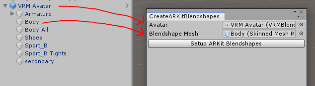

# Aiba's ARKit Tools
## Usage
- Open Aiba Tools -> Setup ARKit Blendshapes
- Put your VRM Object (the one with the "VRM Meta" script on it) into the "Avatar" field
- Put your face skinned mesh renderer in the "Blendshape Mesh" field
- Click "Setup ARKit Blendshapes"
- Done :^)

